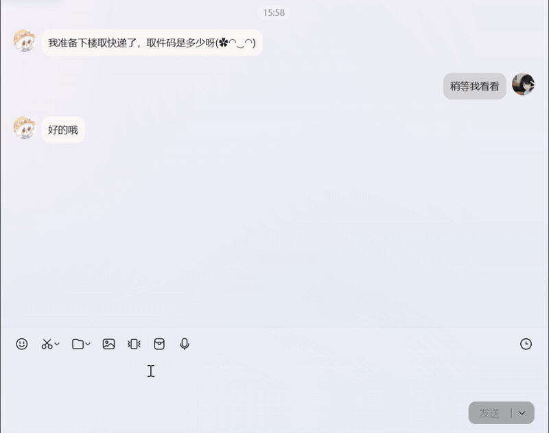

# LiuYun Clipboard Manager

LiuYun 是一个基于 WinUI 3 的 Windows 剪贴板管理工具，聚焦“快速找回、快速回填、轻量常驻”。

## 安装

[下载发布版](https://github.com/xiuxiu733/LiuYun/releases) | [提交问题](https://github.com/xiuxiu733/LiuYun/issues) | [开源协议](LICENSE)

## 基本使用

1. 在任意应用复制文本或图片，LiuYun 会自动记录到历史列表。
2. 使用全局热键呼出主窗口（默认 `双击CTRL`，可在设置中修改）。
3. 选中条目后按 `Enter` 或鼠标左键，可一键回填到当前光标位置；也可用 `↑/↓` 快速切换。
4. 重要内容可置顶或加入“常用”，常用页支持快速复制。
5. 主窗口底部支持分类与时间筛选；设置页可进行数据迁移、导入导出和热键配置。

## 项目来源声明

本项目最初基于微软 WinUI 示例项目 `winui-notes` 演化而来：  
`https://github.com/MicrosoftDocs/windows-topic-specific-samples/tree/winui-3/tutorials/winui-notes`
该示例是 WinUI 便签教程项目。LiuYun 后续已完成大量重构与功能重建，当前功能定位与原示例项目已无直接关联。

## 许可证

本项目使用 **GNU General Public License v3.0 (GPL-3.0)**，详见 `LICENSE`
